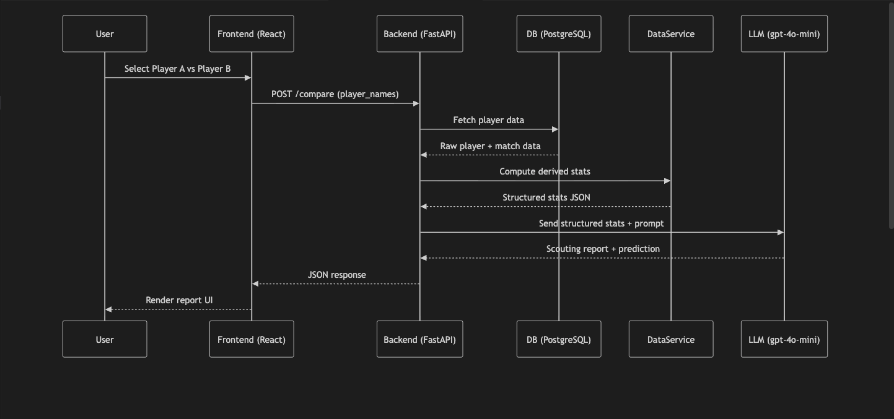

# tennis-scout-agent

Full-stack MVP for tennis scouting:
- Frontend: React + Tailwind (Vite)
- Backend: FastAPI + SQLAlchemy
- Database: PostgreSQL
- AI: OpenAI API integration with local fallback text when key is missing

## Architecture Diagram

## Project structure

- frontend/ – React UI (`PlayerInput`, `StatsTable`, `ReportDisplay`)
- backend/ – FastAPI app (`/health`, `/player/{name}`, `/compare`)
- data/ – `seed_data.py` for sample players/matches
- .env.example – environment variable template

## Project Structure Deep Dive

This section explains what each folder and file does so engineers can quickly understand where to work.

### Root

- `README.md`
	- Primary project documentation: setup, environment variables, how to run both services, and endpoint overview.
- `plan.md`
	- Original implementation plan used to scaffold this MVP (architecture, milestones, and feature targets).
- `.env.example`
	- Template for runtime config values.
	- Copy to `.env` and set secrets/connection values per local environment.
- `.gitignore`
	- Prevents committing virtual env files, frontend build/dependency artifacts, and other generated files.
- `LICENSE`
	- Project licensing terms.

---

### `backend/`

FastAPI application, domain models, API routes, and service layer.

#### `backend/requirements.txt`
- Python dependency lock list for backend runtime:
	- API framework (`fastapi`, `uvicorn`)
	- ORM/data access (`sqlalchemy`, `psycopg`)
	- config/env handling (`python-dotenv`, `pydantic-settings`)
	- LLM client (`openai`)

#### `backend/__init__.py`
- Marks `backend` as a package so imports from root are reliable in scripts/tools.

#### `backend/app/`

- `main.py`
	- FastAPI app entrypoint.
	- Configures app metadata and CORS for frontend access.
	- Exposes `GET /health` and mounts player routes.

- `config.py`
	- Centralized settings model (environment-driven).
	- Loads `.env` values (e.g., `POSTGRES_URL`, `OPENAI_API_KEY`, `OPENAI_MODEL`).
	- Uses cached `get_settings()` to avoid repeated settings parsing.

- `db.py`
	- Shared SQLAlchemy engine/session factory (`engine`, `SessionLocal`).
	- Useful as a single DB bootstrap location as project grows.

- `models.py`
	- SQLAlchemy ORM schema definitions.
	- `Player`: identity/profile data.
	- `Match`: per-match stats, result, date, and JSON stats payload.
	- Relationship mapping: one player to many matches.

- `routes/__init__.py`
	- Package marker for route modules.

- `routes/player_routes.py`
	- API handlers for core product behavior:
		- `GET /player/{name}`: fetches player snapshot + generated scouting report.
		- `POST /compare`: compares multiple players and returns comparative report.
	- Validates compare payload via Pydantic model.

- `services/__init__.py`
	- Package marker for backend service modules.

- `services/data_service.py`
	- Data-access + stats aggregation layer.
	- Opens SQLAlchemy sessions and queries `Player`/`Match` records.
	- Computes derived metrics (win %, surface split, recent form, serve averages).
	- Provides `get_player_snapshot()` and `compare_players()` used by route handlers.

- `services/llm_service.py`
	- AI report generation layer.
	- Builds structured prompts from stats snapshots.
	- Calls OpenAI Responses API when key is present.
	- Returns safe local fallback text if `OPENAI_API_KEY` is not configured.

---

### `frontend/`

React single-page app built with Vite and styled with Tailwind.

- `package.json`
	- Frontend dependencies and scripts (`dev`, `build`, `preview`).
	- Contains React, Axios, Vite, Tailwind, PostCSS toolchain.

- `index.html`
	- SPA host page containing the root mounting node.

- `vite.config.js`
	- Vite build/dev-server config with React plugin.

- `tailwind.config.js`
	- Tailwind content scan configuration for JSX/HTML files.

- `postcss.config.js`
	- PostCSS plugin chain (`tailwindcss`, `autoprefixer`).

- `src/main.jsx`
	- Frontend bootstrap file.
	- Mounts React app into DOM and applies global styles.

- `src/index.css`
	- Tailwind directives and global baseline styles.

- `src/App.jsx`
	- Page composition and UI state orchestration.
	- Handles search flow, loading/error states, and report rendering.

- `src/utils.js`
	- API client helpers (Axios).
	- Defines backend base URL resolution and player report fetch call.

- `src/components/PlayerInput.jsx`
	- Search input + submit action for player lookup.
	- Supports Enter-to-submit and loading-disabled behavior.

- `src/components/StatsTable.jsx`
	- Renders structured player stats and key metric cards.

- `src/components/ReportDisplay.jsx`
	- Presents the generated AI scouting report with readable formatting.

---

### `data/`

- `seed_data.py`
	- DB bootstrap script for local development.
	- Creates schema, clears previous seed rows, inserts sample players/matches.
	- Enables immediate API testing without external data ingestion.

## Prerequisites

- Node.js + npm
- Python 3.10+
- PostgreSQL running locally on port 5432

## Install dependencies

### Backend (Python)

From repo root:

1. Create virtual environment:
	- `python3 -m venv .venv`
2. Install backend packages:
	- `.venv/bin/pip install -r backend/requirements.txt`

### Frontend (Node)

From `frontend/`:

- `npm install`

## Environment

1. Copy `.env.example` to `.env`
2. Set values:
	- `POSTGRES_URL=postgresql+psycopg://localhost:5432/tennis_scout`
	- `OPENAI_API_KEY=...` (optional; if omitted the API returns fallback report text)

## Database setup

Create DB if needed:
- `createdb tennis_scout`

Seed sample data:
- `.venv/bin/python data/seed_data.py`

## Run the app

### Backend

From repo root:
- `.venv/bin/python -m uvicorn app.main:app --app-dir backend --reload`

### Frontend

From `frontend/`:
- `npm run dev`

Open `http://localhost:5173`.

## API endpoints

- `GET /health`
- `GET /player/{name}`
- `POST /compare`
  - body: `{ "player_names": ["Carlos Alcaraz", "Jannik Sinner"] }`