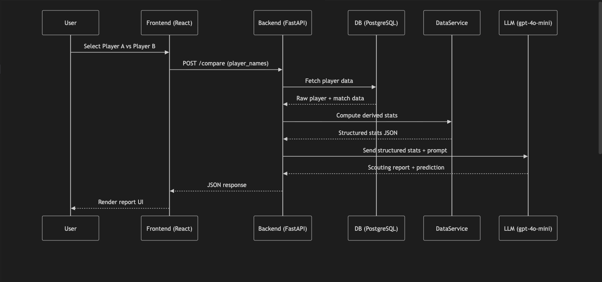

# tennis-scout-agent

Full-stack MVP for tennis scouting:
- Frontend: React + Tailwind (Vite)
- Backend: FastAPI + SQLAlchemy
- Database: PostgreSQL
- AI: OpenAI API integration with local fallback text when key is missing

## Architecture Diagram


## Project structure

- frontend/ – React UI (`PlayerInput`, `StatsTable`, `ReportDisplay`)
- backend/ – FastAPI app (`/health`, `/player/{name}`, `/compare`)
- data/ – `seed_data.py` for sample players/matches
- .env.example – environment variable template

## Project Structure Deep Dive

This section explains what each folder and file does so engineers can quickly understand where to work.

### Root

- `README.md`
	- Primary project documentation: setup, environment variables, how to run both services, and endpoint overview.
- `plan.md`
	- Original implementation plan used to scaffold this MVP (architecture, milestones, and feature targets).
- `.env.example`
	- Template for runtime config values.
	- Copy to `.env` and set secrets/connection values per local environment.
- `.gitignore`
	- Prevents committing virtual env files, frontend build/dependency artifacts, and other generated files.
- `LICENSE`
	- Project licensing terms.

---

### `backend/`

FastAPI application, domain models, API routes, and service layer.

#### `backend/requirements.txt`
- Python dependency lock list for backend runtime:
	- API framework (`fastapi`, `uvicorn`)
	- ORM/data access (`sqlalchemy`, `psycopg`)
	- config/env handling (`python-dotenv`, `pydantic-settings`)
	- LLM client (`openai`)
	- Cache client (`redis`) — optional; used by `cache_service` when `REDIS_URL` is set

#### `backend/__init__.py`
- Marks `backend` as a package so imports from root are reliable in scripts/tools.

#### `backend/app/`

- `main.py`
	- FastAPI app entrypoint.
	- Configures app metadata and CORS for frontend access.
	- Exposes `GET /health` and mounts player routes.

- `config.py`
	- Centralized settings model (environment-driven).
	- Loads `.env` values (e.g., `POSTGRES_URL`, `OPENAI_API_KEY`, `OPENAI_MODEL`).
	- Uses cached `get_settings()` to avoid repeated settings parsing.

- `db.py`
	- Shared SQLAlchemy engine/session factory (`engine`, `SessionLocal`).
	- Useful as a single DB bootstrap location as project grows.

- `models.py`
	- SQLAlchemy ORM schema definitions.
	- `Player`: identity/profile data.
	- `Match`: per-match stats, result, date, and JSON stats payload.
	- Relationship mapping: one player to many matches.

- `routes/__init__.py`
	- Package marker for route modules.

- `routes/player_routes.py`
	- API handlers for core product behavior:
		- `GET /player/{name}`: fetches player snapshot + generated scouting report.
		- `POST /compare`: compares multiple players and returns comparative report.
	- Validates compare payload via Pydantic model.

- `services/__init__.py`
	- Package marker for backend service modules.

- `services/data_service.py`
	- Data-access + stats aggregation layer.
	- Opens SQLAlchemy sessions and queries `Player`/`Match` records.
	- Computes derived metrics (win %, surface split, recent form, serve averages).
	- Provides `get_player_snapshot()` and `compare_players()` used by route handlers.

- `services/llm_service.py`
	- AI report generation layer.
	- Builds structured prompts from stats snapshots.
	- Calls OpenAI Responses API when key is present.
	- Returns safe local fallback text if `OPENAI_API_KEY` is not configured.

---

### `frontend/`

React single-page app built with Vite and styled with Tailwind.

- `package.json`
	- Frontend dependencies and scripts (`dev`, `build`, `preview`).
	- Contains React, Axios, Vite, Tailwind, PostCSS toolchain.

- `index.html`
	- SPA host page containing the root mounting node.

- `vite.config.js`
	- Vite build/dev-server config with React plugin.

- `tailwind.config.js`
	- Tailwind content scan configuration for JSX/HTML files.

- `postcss.config.js`
	- PostCSS plugin chain (`tailwindcss`, `autoprefixer`).

- `src/main.jsx`
	- Frontend bootstrap file.
	- Mounts React app into DOM and applies global styles.

- `src/index.css`
	- Tailwind directives and global baseline styles.

- `src/App.jsx`
	- Page composition and UI state orchestration.
	- Handles search flow, loading/error states, and report rendering.

- `src/utils.js`
	- API client helpers (Axios).
	- Defines backend base URL resolution and player report fetch call.

- `src/components/PlayerInput.jsx`
	- Search input + submit action for player lookup.
	- Supports Enter-to-submit and loading-disabled behavior.

- `src/components/StatsTable.jsx`
	- Renders structured player stats and key metric cards.

- `src/components/ReportDisplay.jsx`
	- Presents the generated AI scouting report with readable formatting.

---

### `data/`

- `seed_data.py`
	- DB bootstrap script for local development.
	- Creates schema, clears previous seed rows, inserts sample players/matches.
	- Enables immediate API testing without external data ingestion.

- `daily_update.py`
	- Daily cron script that polls the ATP API and upserts fresh data into PostgreSQL.
	- Runs five steps in sequence: rankings → recent matches → tournament details → career stats → head-to-head recompute.
	- All writes are idempotent (safe to run multiple times).
	- See [Daily database update](#daily-database-update) for setup and configuration.


## Prerequisites

- Node.js + npm
- Python 3.10+
- PostgreSQL running locally on port 5432

## Install dependencies

### Backend (Python)

From repo root:

1. Create virtual environment:
	- `python3 -m venv .venv`
2. Install backend packages:
	- `.venv/bin/pip install -r backend/requirements.txt`

### Frontend (Node)

From `frontend/`:

- `npm install`

## Environment

1. Copy `.env.example` to `.env`
2. Set values:
	- `POSTGRES_URL=postgresql+psycopg://localhost:5432/tennis_scout`
	- `OPENAI_API_KEY=...` (optional; if omitted the API returns fallback report text)
	- `REDIS_URL=redis://localhost:6379/0` (optional; enables the LLM response cache — see section below)

## Database setup

Create DB if needed:
- `createdb tennis_scout`

Seed sample data:
- `.venv/bin/python data/seed_data.py`

## Run the app

### Backend

From repo root:
- `.venv/bin/python -m uvicorn app.main:app --app-dir backend --reload`

### Frontend

From `frontend/`:
- `npm run dev`

Open `http://localhost:5173`.

## API endpoints

- `GET /health`
- `GET /player/{name}`
- `POST /compare`
  - body: `{ "player_names": ["Carlos Alcaraz", "Jannik Sinner"] }`
- `GET /players/search?q=<query>&limit=<n>`
  - Autocomplete suggestions for the search inputs; case-insensitive substring match on `full_name`, ordered by `current_ranking`.

## Daily database update

`data/daily_update.py` keeps the database current by polling the ATP API once per day. It runs five steps:

| Step | What it updates | Source |
|------|----------------|--------|
| 1 | `players.current_ranking` | ATP rankings endpoint |
| 2 | `matches`, `player_stats`, `tournaments` (stubs) | ATP past-matches endpoint (last N days) |
| 3 | `tournaments` (name, surface, location) | ATP tournament info endpoint |
| 4 | `player_stats` (career aggregates) | ATP career stats endpoint |
| 5 | `head_to_head` win counts | Recomputed from matches in DB (no API call) |

### Schedule (local cron)

The script is designed to run as a local cron job. Install it with:

```bash
(crontab -l 2>/dev/null; echo "0 2 * * * /path/to/.venv/bin/python /path/to/data/daily_update.py >> /path/to/logs/daily_update.log 2>&1") | crontab -
```

Replace `/path/to` with your absolute project root. The default schedule is **2 AM daily** — change the first two fields to adjust:

| Cron expression | Runs at |
|----------------|---------|
| `0 2 * * *` | 2 AM daily (default) |
| `0 6 * * *` | 6 AM daily |
| `0 */6 * * *` | Every 6 hours |
| `0 2 * * 1` | 2 AM every Monday |

To view or edit the current schedule: `crontab -e`

Logs are appended to `logs/daily_update.log` in the project root.

### Run manually

```bash
# Full run
.venv/bin/python data/daily_update.py

# Dry run (no DB writes)
.venv/bin/python data/daily_update.py --dry-run --verbose

# Fast run — skip the slow career stats step (~17 min for 200 players)
.venv/bin/python data/daily_update.py --skip-stats --verbose

# Fetch only the last 7 days of matches instead of the default 30
.venv/bin/python data/daily_update.py --lookback-days 7
```

### Configuration flags

| Flag | Default | Description |
|------|---------|-------------|
| `--lookback-days N` | `30` | Fetch matches from last N days |
| `--batch-size N` | `50` | Batch size for career stats ingestion |
| `--skip-rankings` | off | Skip step 1 |
| `--skip-matches` | off | Skip step 2 |
| `--skip-tournaments` | off | Skip step 3 |
| `--skip-stats` | off | Skip step 4 (slowest — ~17 min) |
| `--skip-h2h` | off | Skip step 5 |
| `--dry-run` | off | Fetch data but do not write to DB |
| `--verbose` | off | Enable DEBUG-level logging |

---

## LLM response cache (optional)

`generate_report()` calls OpenAI on every request by default. To cut latency and API spend on repeated lookups (e.g. popular players), the backend can cache LLM responses in Redis. The cache is optional — if `REDIS_URL` is unset or Redis is unreachable, the backend falls through to a direct OpenAI call.

### Enable

1. Install and start Redis:
	- macOS: `brew install redis && redis-server --daemonize yes`
	- Docker: `docker run -d -p 6379:6379 redis:7-alpine`
2. Add to `.env`:
	```
	REDIS_URL=redis://localhost:6379/0
	LLM_CACHE_ENABLED=true          # optional, default true
	LLM_CACHE_TTL_SECONDS=86400     # optional, default 24h
	```
3. Restart the backend. Startup logs should show `Redis cache enabled at redis://localhost:6379/0.`

### Verify it's working

Every report response now includes a `cache` field in its `llm` metadata. Hit the same player twice:

```bash
curl -s http://localhost:8000/player/Carlos%20Alcaraz | jq '.llm'
# First call:  "cache": "miss"  (took ~3s)
curl -s http://localhost:8000/player/Carlos%20Alcaraz | jq '.llm'
# Second call: "cache": "hit"   (~20ms)
```

Values:
- `"hit"` — served from Redis
- `"miss"` — cache enabled but key wasn't present; written after the LLM call (only on successful responses)
- `"disabled"` — `REDIS_URL` unset or Redis unreachable; request still succeeds via direct OpenAI

### Inspect what's in the cache

Cache keys are namespaced `llm_report:{model}:{sha256(prompt)}`.

```bash
# Total keys in the DB
redis-cli DBSIZE

# List all cached LLM-report keys
redis-cli --scan --pattern 'llm_report:*'

# Time-to-live of a specific key (seconds remaining)
redis-cli TTL 'llm_report:gpt-4o-mini:af3bfb518fd8a0...'

# View the cached value (full ReportResult JSON)
redis-cli GET 'llm_report:gpt-4o-mini:af3bfb518fd8a0...'

# Live monitor of commands hitting Redis (useful when smoke-testing)
redis-cli MONITOR
```

### Clear the cache

```bash
# Delete one entry
redis-cli DEL 'llm_report:gpt-4o-mini:af3bfb518fd8a0...'

# Delete all cached LLM reports (preserves any other keys)
redis-cli --scan --pattern 'llm_report:*' | xargs -r redis-cli DEL

# Nuke everything in the current Redis DB
redis-cli FLUSHDB
```

Cache keys are **self-invalidating**: the prompt embeds ranking, recent form, and stats, so the SHA-256 changes whenever the underlying data changes — old entries are orphaned and age out via TTL. You should rarely need to flush manually.