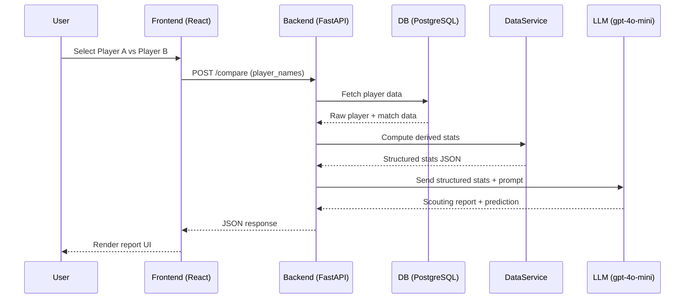

```mermaid
sequenceDiagram
    participant User
    participant FE as Frontend (React)
    participant BE as Backend (FastAPI)
    participant DBPG as DB (PostgreSQL)
    participant DataService
    participant LLM as LLM (gpt-4o-mini)

    User->>FE: Select Player A vs Player B
    FE->>BE: POST /compare (player_names)

    BE->>DBPG: Fetch player data
    DBPG-->>BE: Raw player + match data

    BE->>DataService: Compute derived stats
    DataService-->>BE: Structured stats JSON

    BE->>LLM: Send structured stats + prompt
    LLM-->>BE: Scouting report + prediction

    BE-->>FE: JSON response
    FE-->>User: Render report UI
```