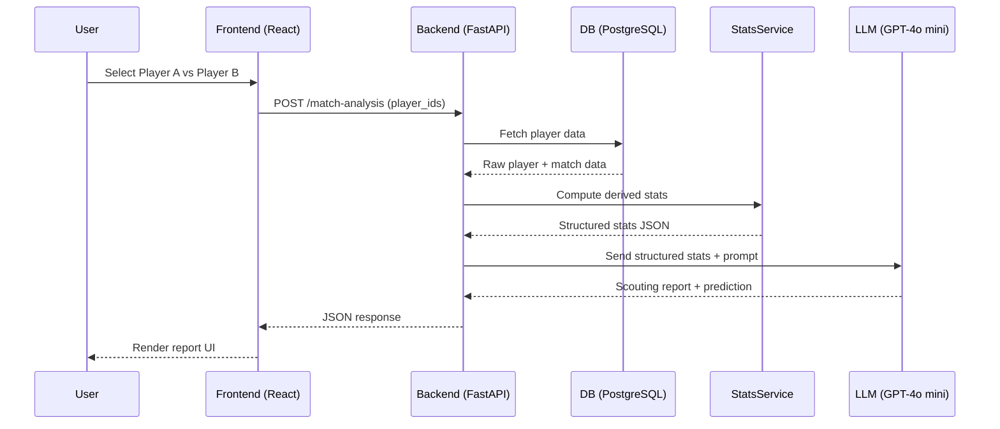

```mermaid
sequenceDiagram
    participant User
    participant Frontend (React)
    participant Backend (FastAPI)
    participant DB (PostgreSQL)
    participant StatsService
    participant LLM (GPT-4o mini)

    User->>Frontend (React): Select Player A vs Player B
    Frontend (React)->>Backend (FastAPI): POST /match-analysis (player_ids)

    Backend (FastAPI)->>DB (PostgreSQL): Fetch player data
    DB (PostgreSQL)-->>Backend (FastAPI): Raw player + match data

    Backend (FastAPI)->>StatsService: Compute derived stats
    StatsService-->>Backend (FastAPI): Structured stats JSON

    Backend (FastAPI)->>LLM (GPT-4o mini): Send structured stats + prompt
    LLM (GPT-4o mini)-->>Backend (FastAPI): Scouting report + prediction

    Backend (FastAPI)-->>Frontend (React): JSON response
    Frontend (React)-->>User: Render report UI
```