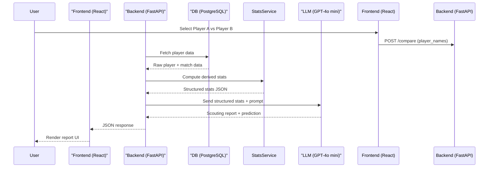

```mermaid
sequenceDiagram
    participant User
    participant FE as "Frontend (React)"
    participant BE as "Backend (FastAPI)"
    participant DBPG as "DB (PostgreSQL)"
    participant StatsService
    participant LLM as "LLM (GPT-4o mini)"

    User->>Frontend (React): Select Player A vs Player B
    Frontend (React)->>Backend (FastAPI): POST /compare (player_names)

    BE->>DBPG: Fetch player data
    DBPG-->>BE: Raw player + match data

    BE->>StatsService: Compute derived stats
    StatsService-->>BE: Structured stats JSON

    BE->>LLM: Send structured stats + prompt
    LLM-->>BE: Scouting report + prediction

    BE-->>FE: JSON response
    FE-->>User: Render report UI
```