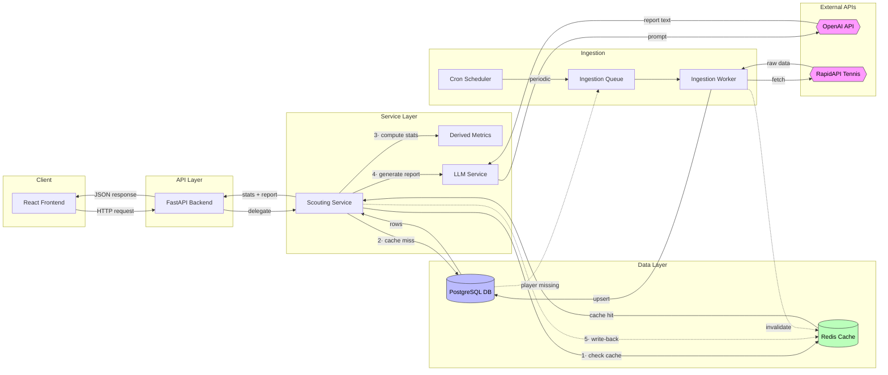

```mermaid
flowchart LR

    subgraph CLIENT["Client"]
        A["React Frontend"]
    end

    subgraph API["API Layer"]
        B["FastAPI Backend"]
    end

    subgraph SVC["Service Layer"]
        direction TB
        D["Scouting Service"]
        L["Derived Metrics"]
        P["LLM Service"]
        D -->|"3· compute stats"| L
        D -->|"4· generate report"| P
    end

    subgraph DATA["Data Layer"]
        direction TB
        K[("Redis Cache")]
        C[("PostgreSQL DB")]
    end

    subgraph EXT["External APIs"]
        direction TB
        Q{{"OpenAI API"}}
        F{{"RapidAPI Tennis"}}
    end

    subgraph ING["Ingestion"]
        direction TB
        G["Cron Scheduler"]
        M["Ingestion Queue"]
        N["Ingestion Worker"]
        G -->|"periodic"| M
        M --> N
    end

    A -->|"HTTP request"| B
    B -->|"JSON response"| A

    B -->|"delegate"| D
    D -->|"stats + report"| B

    D -->|"1· check cache"| K
    K -->|"cache hit"| D
    D -->|"2· cache miss"| C
    C -->|"rows"| D
    D -.->|"5· write-back"| K

    P -->|"prompt"| Q
    Q -->|"report text"| P

    C -.->|"player missing"| M
    N -->|"fetch"| F
    F -->|"raw data"| N
    N -->|"upsert"| C
    N -.->|"invalidate"| K

    F:::external
    Q:::external
    C:::database
    K:::cache

    classDef external fill:#f9f,stroke:#333,color:#000,stroke-width:1px
    classDef database fill:#bbf,stroke:#333,color:#000,stroke-width:1px
    classDef cache fill:#bfb,stroke:#333,color:#000,stroke-width:1px
```